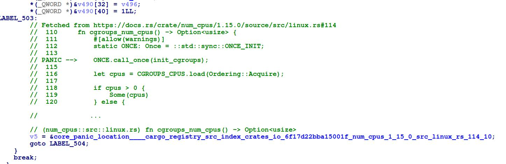

# Rust metadata helper for IDA

This IDA script does two things:

- it renames and retype every panics found in your target executable:

- it comments decompiler output with matching code, giving you the exact panic location in source code:

# Want to extend the plugin ?

You can implement your own disassembler class to extend this script to binary ninja or else. To do so, create a class that herits from `./rusthelper/impl/generic.py`, and use it instead of the default `IDAImpl`.

# Acknowledgments

This is based on Cindy Xiao's [blog and Binary ninja plugin](https://cxiao.net/posts/2023-12-08-rust-reversing-panic-metadata/).