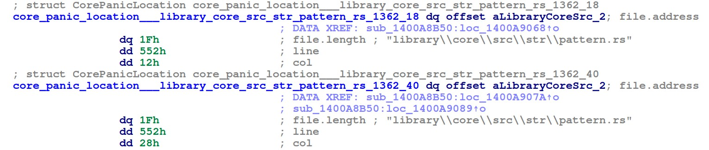

IDA naive implementation of [Cindʎ Xiao](https://cxiao.net/)'s [rust metadata carver](https://github.com/cxiao/rust_metadata_carver) plugin for Binary Ninja.

Her plugin is explained in a great blog post you can find [here](https://cxiao.net/posts/2023-12-08-rust-reversing-panic-metadata/).

It explains how it works and the limitations, the main limitation being that -I quote- "Type layouts in compiled Rust binaries are not stable".
This means that you might have to edit the two dataclasses in this script along with `find_panic_location_in_segm` method.

If the script works, it should rename and retype panic error messages in your target rust executable.

Use it using `File -> script file` in IDA. Requires IDA python.

